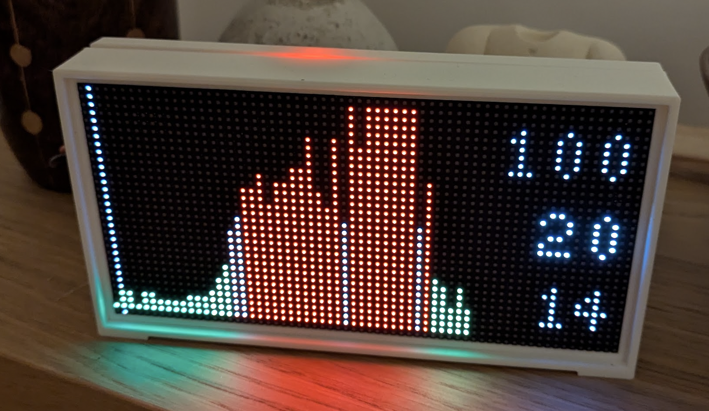

A 64x32 LED display to show the day's Octopus Agile prices.

Thanks to [Knifa for the hardware design](https://www.thingiverse.com/thing:4552215).

I'm running this on a Raspberry Pi 3A+.

Start on boot with:

```
sudo cp display.service /etc/systemd/system
sudo systemctl daemon-reload
sudo systemctl start display
```

Regenerate the Octopus API bindings with:

```
curl -L https://api.octopus.energy/v1/schema?namespaces=default | sed -e "s/type: datetime/type: string/" > octopus.schema && npx openapi-typescript octopus.schema -o src/octopus-schema.d.ts
```
